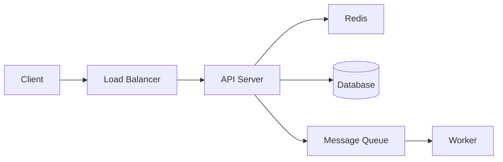

# Protocol 331: System Design Framework

> **Source**: system-design-primer (330K ⭐). Integrated 02 January 2026.  
> **Purpose**: Structured approach to designing scalable systems.

---

## 4-Step Framework

### Step 1: Outline Use Cases, Constraints, Assumptions

**Clarify before designing.** Ask:

| Category | Questions |
|----------|-----------|
| Users | Who uses it? How many? |
| Functionality | What does the system do? Inputs/outputs? |
| Scale | How much data? Requests per second? |
| Patterns | Read-heavy or write-heavy? |
| Constraints | Latency requirements? Consistency needs? |

**Output**: Bulleted list of requirements and constraints.

---

### Step 2: High-Level Design

**Sketch the architecture.** Include:

- Main components (services, databases, caches)
- Connections between components
- Data flow direction

**Format**: ASCII diagram or Mermaid.

**Justify each component.**

---

### Step 3: Design Core Components

**Deep dive into each component.**

| Component | Design Questions |
|-----------|------------------|
| Database | SQL or NoSQL? Schema? Indexing? |
| API | REST or RPC? Endpoints? Auth? |
| Cache | What to cache? TTL? Invalidation? |
| Storage | Object storage? CDN? |
| Queue | Sync or async? Retry logic? |

**Trade-offs**: State alternatives considered and why rejected.

---

### Step 4: Scale the Design

**Address bottlenecks.**

| Technique | When to Use |
|-----------|-------------|
| Load Balancer | Distribute traffic |
| Horizontal Scaling | Stateless services |
| Database Sharding | Write-heavy, large data |
| Caching | Read-heavy |
| CDN | Static content, global users |
| Message Queues | Decouple services, async |

**Discuss trade-offs.** Everything is a trade-off.

---

## Back-of-Envelope Reference

### Powers of Two

| Power | Exact | Approx |
|-------|-------|--------|
| 10 | 1,024 | ~1K |
| 20 | 1,048,576 | ~1M |
| 30 | 1,073,741,824 | ~1B |
| 40 | 1,099,511,627,776 | ~1T |

### Latency Numbers

| Operation | Time |
|-----------|------|
| L1 cache | 0.5 ns |
| L2 cache | 7 ns |
| RAM | 100 ns |
| SSD read | 150 μs |
| HDD read | 10 ms |
| Network round-trip (same DC) | 500 μs |
| Network round-trip (cross-continent) | 150 ms |

---

## Example Application

**Task**: "Design a URL shortener"

1. **Outline**: 100M URLs, 10K writes/day, 1M reads/day (read-heavy)
2. **High-Level**: API → Cache → DB, hash-based lookup
3. **Core**: Base62 encoding, Redis cache, PostgreSQL storage
4. **Scale**: CDN for redirects, read replicas, sharding by hash prefix

---

## Integration with Athena

- **Trigger**: "Design a system for X" or "How would you architect Y"
- **Mode**: Use with `/think` or `/ultrathink` for complex designs
- **Output**: Follow 4-step format in response

---

## Related Protocols

- [Protocol 330](file:///Users/winstonkoh/Desktop/Project Athena/.agent/skills/protocols/architecture/330-scale-adaptive-intelligence.md): Scale-Adaptive Intelligence
- [Protocol 49](file:///Users/winstonkoh/Desktop/Project Athena/.agent/skills/protocols/decision/49-efficiency-robustness-tradeoff.md): Efficiency-Robustness Tradeoff

---

## Tagging

# protocol #engineering #system-design #architecture #interview
